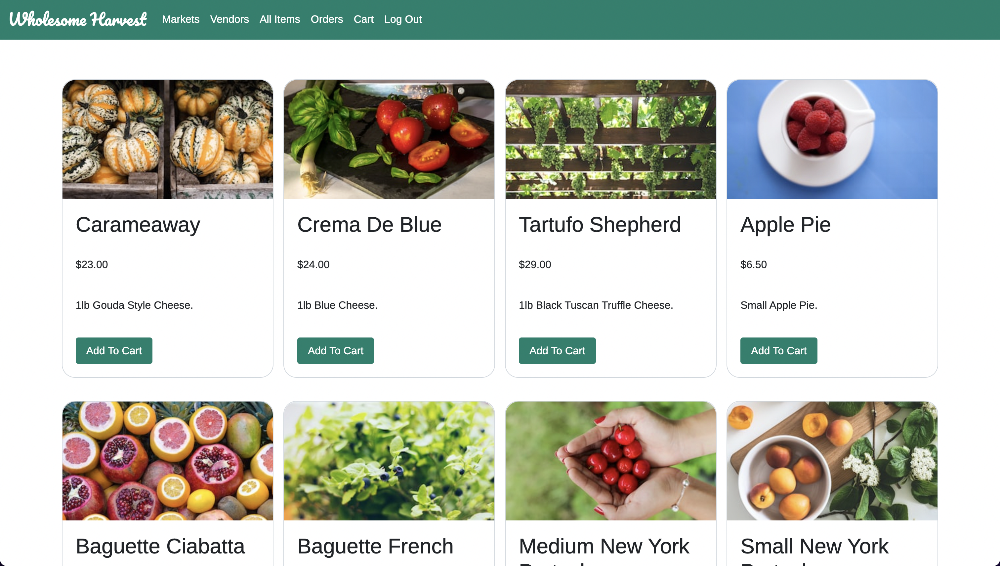
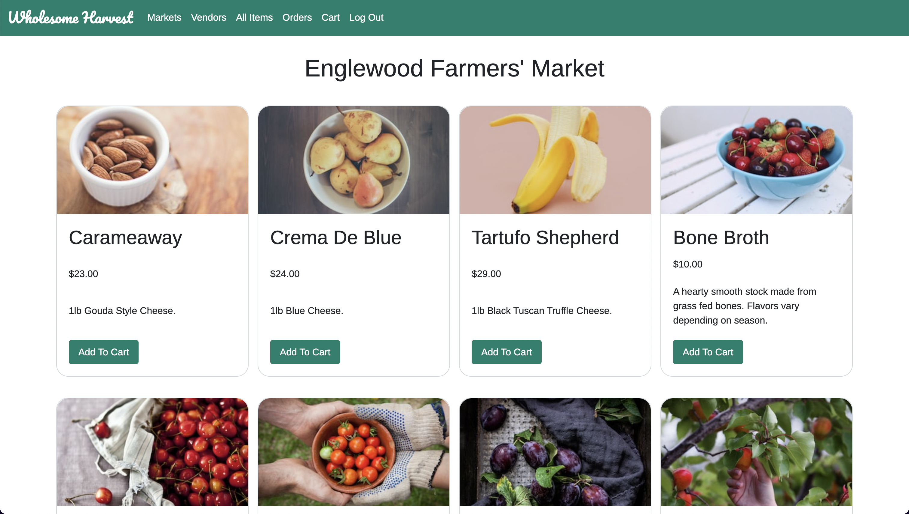
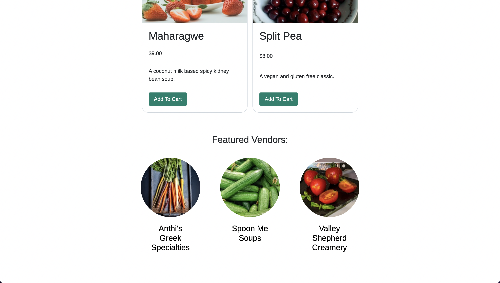

# Wholesome Harvest: An Online Farmers' Market - MERN-stack App

## App Description

Wholesome Harvest is a dynamic MERN-stack (MongoDB, Express.js, React, and Node.js) application designed to bridge the gap between consumers and local producers within the realm of an online marketplace. This platform enables users to explore a diverse array of locally sourced products offered by farmers' markets, empowering convenient product browsing, and secure transactions facilitated by Stripe integration.

## App Screenshots

## Technologies Used

    ☐ JavaScript
    ☐ HTML
    ☐ CSS
    ☐ Stripe
    ☐ MongoDB
    ☐ Express
    ☐ React
    ☐ Node.js
    ☐ JSX

## Getting Started

[Heroku](https://farmers-market-app-d904553d399f.herokuapp.com/)
[Trello Board](https://trello.com/b/i3US1slW/sei-project-4-farmers-market-app)

## Next Steps

    ☐ Implementing item reviews.
    ☐ Allowing users to search and filter items by category, price range, ratings, etc...
    ☐ Allowing users to schedule order pick-ups and deliveries.
    ☐ Add real-time notifications to update users on the status of their orders.
